# 移动端调试

## iOS之Safari调试webView/H5页面
### 一、开启Safari开发菜单
在Mac的Safari偏好设置中，开启开发菜单。具体步骤为：Safari -> 偏好设置… -> 高级 -> 勾选在菜单栏显示“开发”菜单。
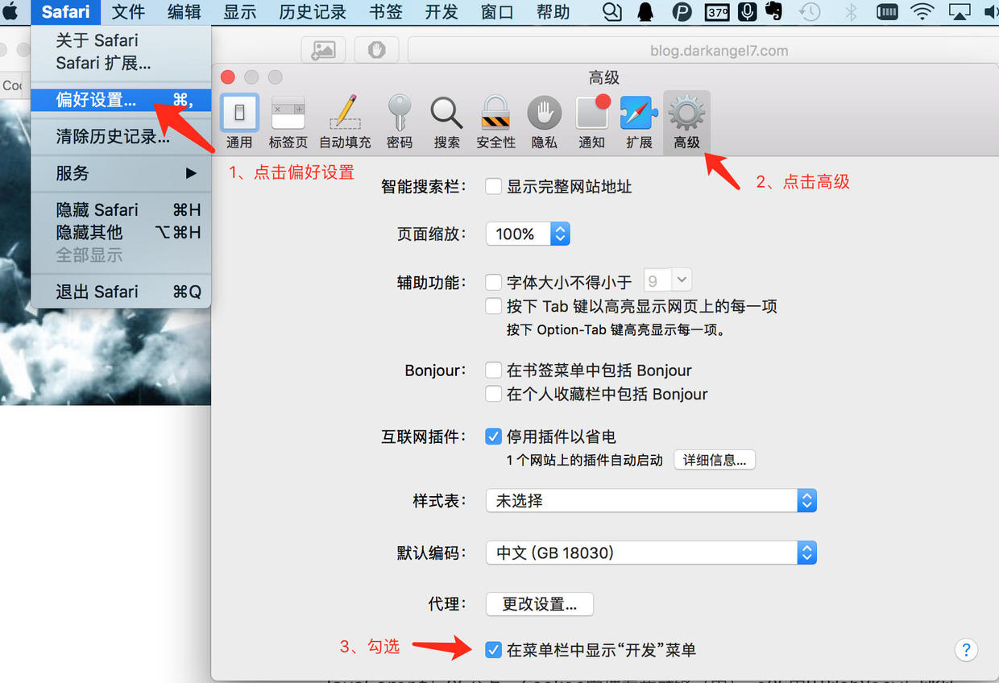

### 二、iPhone开启Web检查器
具体步骤为：设置 -> Safari -> 高级 -> Web 检查器。
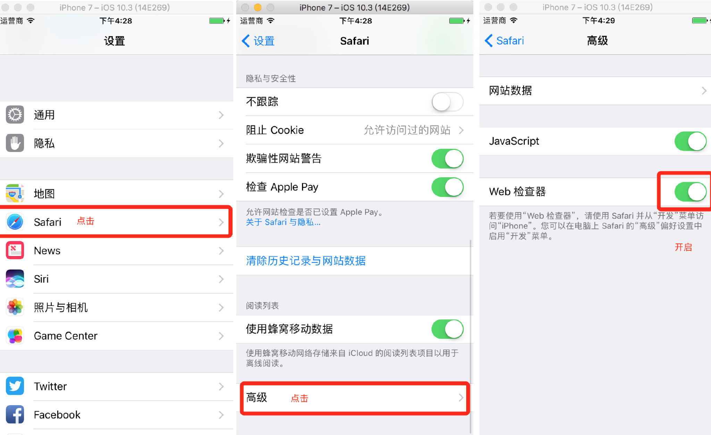

### 三、运行App
打开项目，Cmd + R 运行，打开想调试的Web页面。
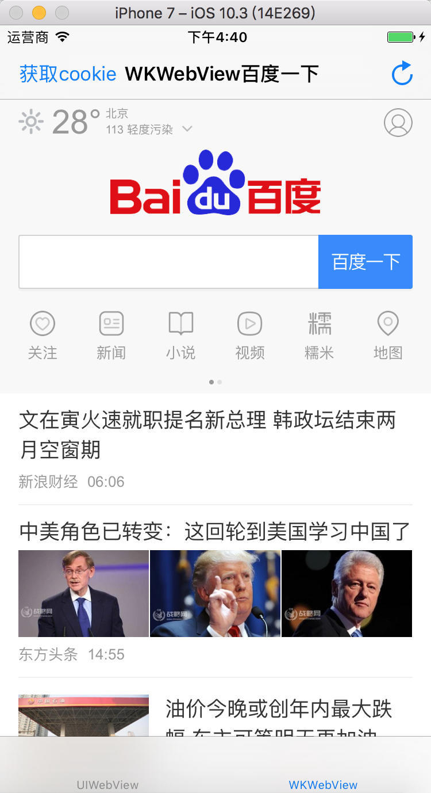

### 四、调试对应的页面
打开Safari -> 开发 -> 设备 -> URL。
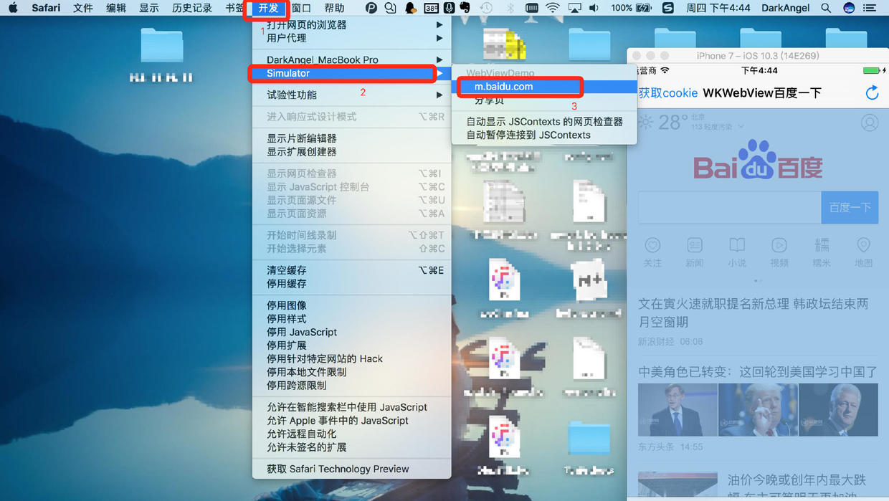

选中的页面会变成蓝色，点击然后打开了如下的界面。
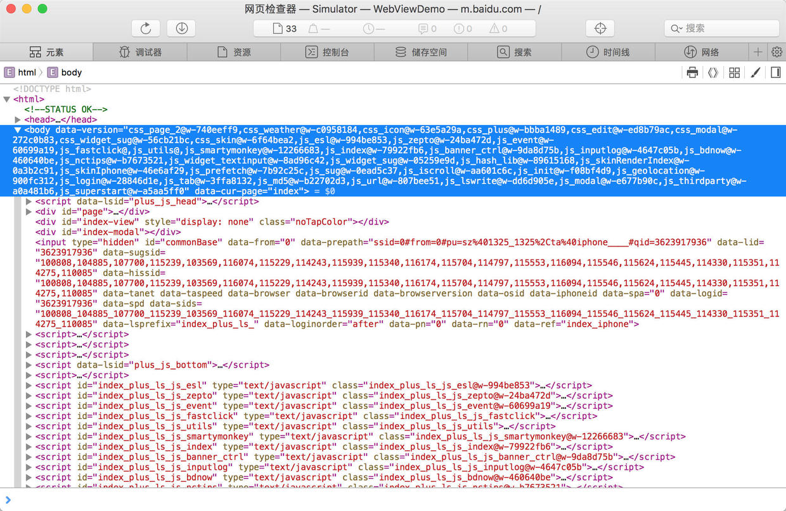

这个页面就很像Windows 平台Chrome的F12。可以打断点：
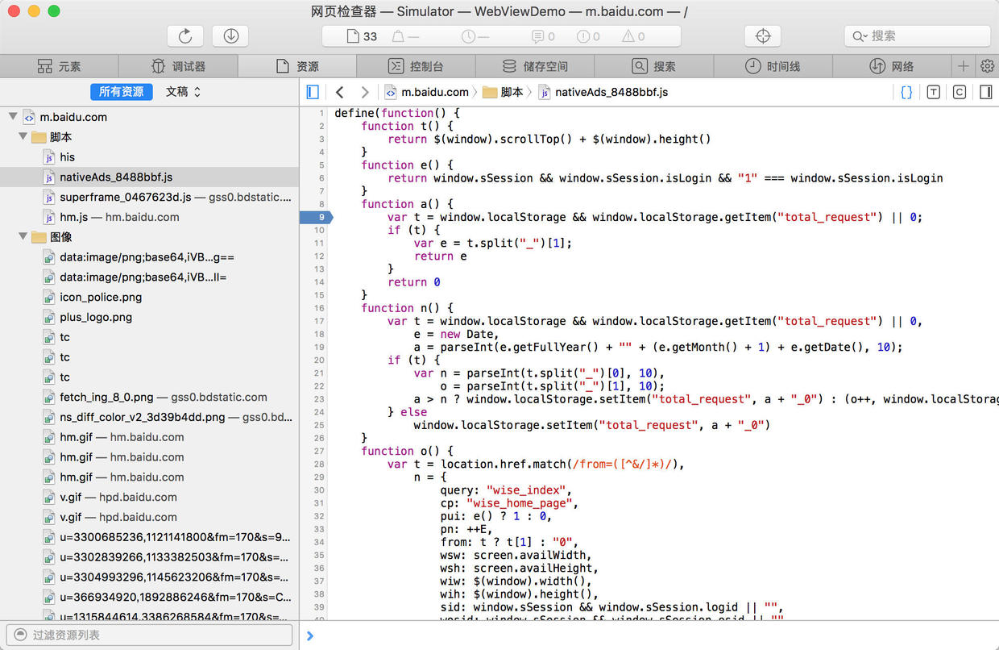

查看断点
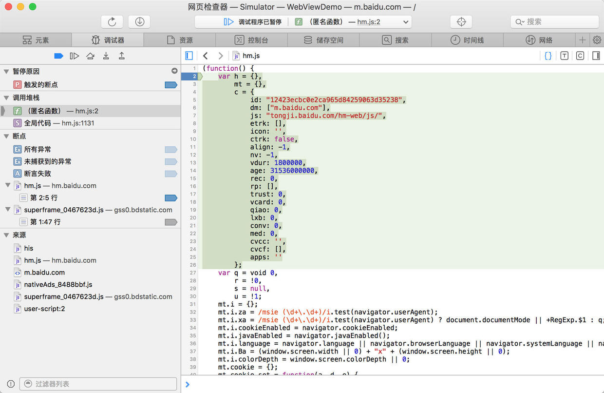

查看Cookie
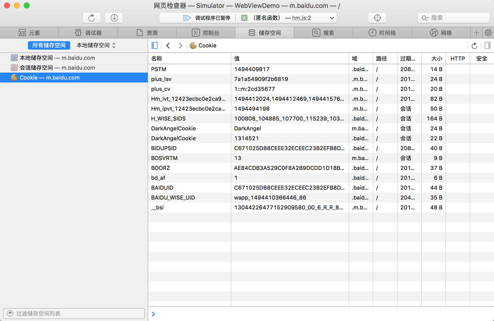

打印Cookie或者元素
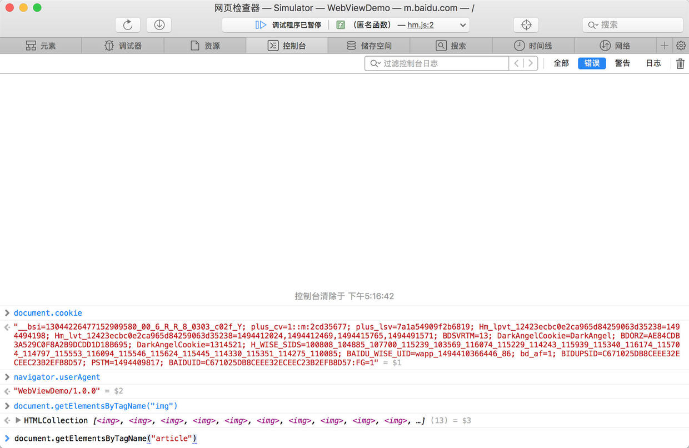

比如在这里Alert页面的title，输入 alert(document.title);，你会在模拟器中看到弹窗
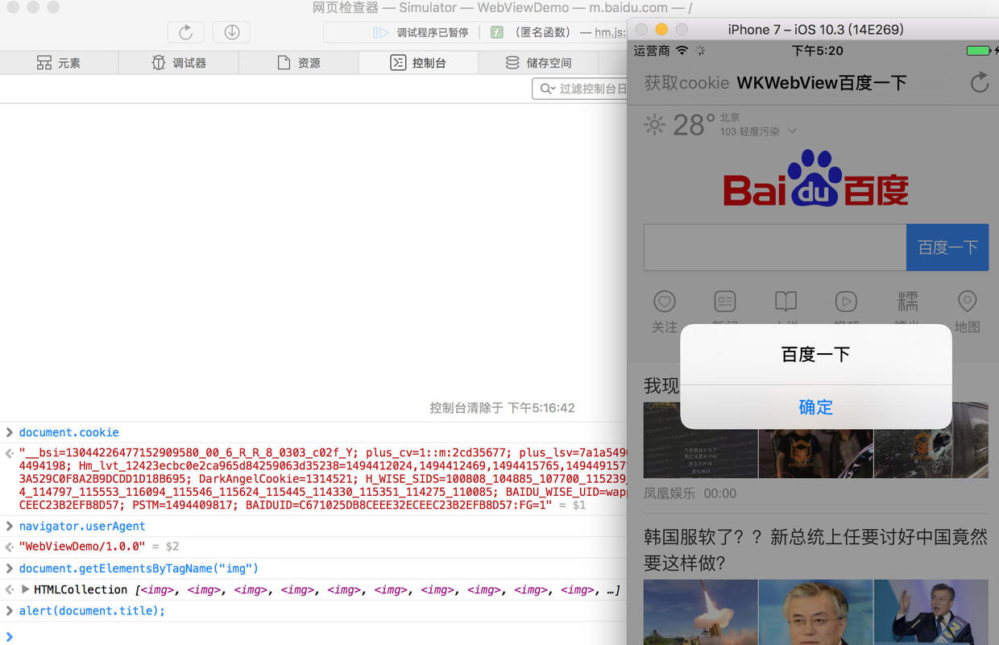

:::tip
浏览器开发者模式上搜索js文件：快捷键【cmd+P】
:::

## 通过Chrome调试安卓机上的H5页面
1. 打开 USB 调试选项：在安卓设备上，进入设置>开发者选项>打开USB调试 (注意：在安卓 4.2 及以后的版本中，默认情况下开发者选项是隐藏的。要启用开发者选项，选择设置>关于手机然后点击版本号7次。)。
2. 在电脑端的Chrome里，在地址栏输入chrome://inspect#device。进入后确认Discover USB devices已经勾选了：
3. 在你的设备上，打开要浏览的页面,会跳出一个弹框，询问你是否要允许在电脑端进行USB调试。选择确定。
4. 点击chrome://inspect/#devices 页面上的inspect便可以审查安卓机上的H5页面的元素了

## 复杂网络、APP环境的调试

需求:

在微信中调试H5页面的微信分享功能,http://m.signature.cn数字签名生成服务使用https协议通信(比如 https://io.signature.cn),数字签名服务只允许*.signature.cn访问

难点:

(1)必须在*.signature.cn环境下进行调试,否则无法访问用来签名的https://io.signature.cn服务

(2)io.signature.cn服务使用https协议通信,中间难以通过代理拦截

(3)分享相关微信jsBridge接口,只在微信App中存在,无法在本地开发环境调用

解决办法(适用于Mac):

(1)下载安装微信Web开发者工具，从这里https://mp.weixin.qq.com/debug/wxadoc/dev/devtools/download.html

(2)下载并安装 Charles，从这里http://xclient.info/s/charles.html

(3)打开Charles，按如图所示方式安装根证书
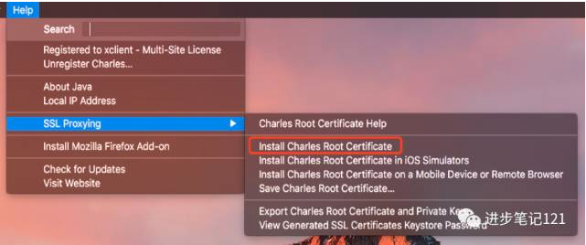

(4)在Proxy -> SSL Proxying Settings 中，加入 *.signature.cn 域名
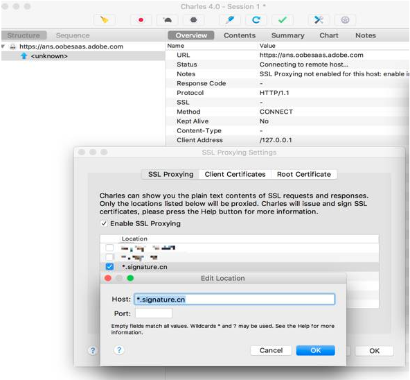

(5)在Tools ->  Map Local 功能中，加入需要代理到本地的线上 URL 到 本地文件夹的对应关系
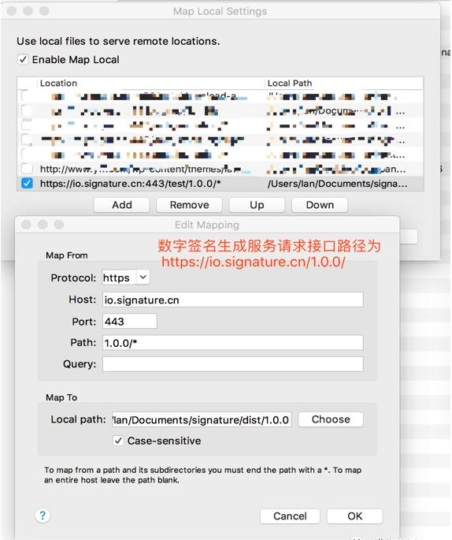

(6)在微信开发者工具中，设置代理到 Charles 端口
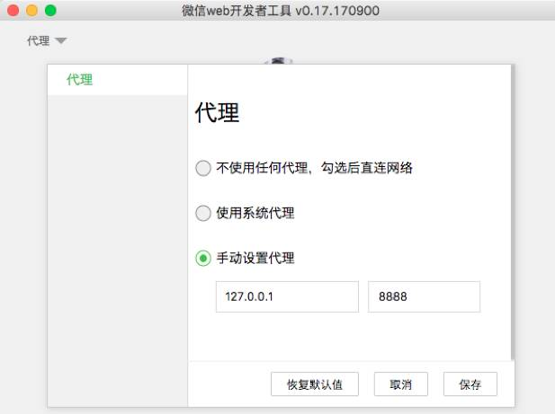

(7)在微信开发者工具中，打开线上地址，可以看到 JS 文件已经被替换，这时候可以在同时有线上 API 和微信 jsBridge 的环境下进行调试
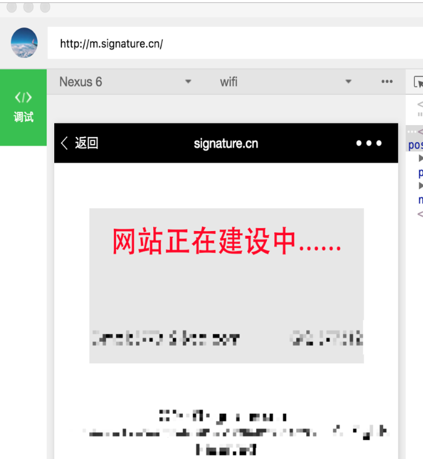
