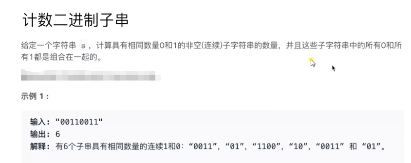

# String

## 2019年09月25日

```js
var countBinarySubstrings = function(s) {
    let current=0, last=0, res=0;
    for(let i=0,len=s.length; i<len; i++) {
		console.log(s[i], s[i-1])
        if(s[i] == s[i-1]) { current++; }
        else {last = current; current=1;}
        if(last >= current) res++;
		console.log(current, last, res)
    }
    return res;
};
countBinarySubstrings('001001')
```
分析：
一、从第一位开始跟前一位对比，如果数值相同，当前的数值连续出现的次数加一，直到遇见当前位的数值与前一位不同时。与当前数值不同的数值之前连续出现的个数last是,current的累积后的数值。然后再给current的计时器重置为1。
二、用last的值与当前的current数值对比，如果last大于等于current，就为包含连续相同数量的0和1的出现次数的计数器res自增1。
三、算法中，出现当前数值与前一位数值不同时，last就被重新赋值前一个数值出现的次数current，然后当前的数值出现的次数重置为1。所以last中存放的永远都是前一位数值连续出现的总次数。当current小于等于local时，必然会有最多会出现local次连续相同数量的0和1的出现，取决于当前数值出现的次数。

这个题好绕………………