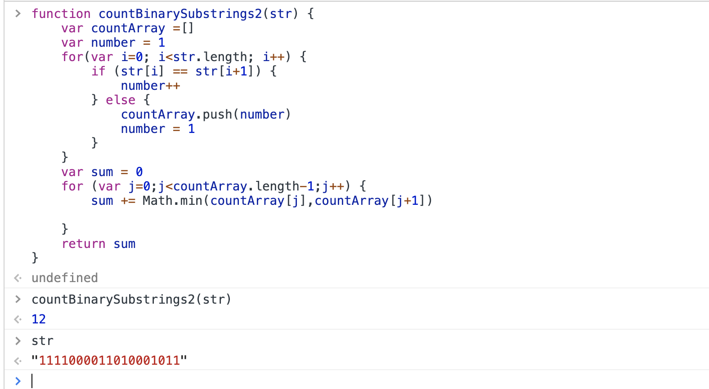

# String

## 2019年09月25日


```js
function countBinarySubstrings2(str) {
    var countArray =[]
    var number = 1
    for(var i=0; i<str.length; i++) {
		if (str[i] == str[i+1]) {
			number++
		} else {
			countArray.push(number)
			number = 1
		}
    }
	var sum = 0
	for (var j=0;j<countArray.length-1;j++) {
		sum += Math.min(countArray[j],countArray[j+1])
		
	}
	return sum
}
```
```js
var countBinarySubstrings = function(s) {
    let current=0, last=0, res=0;
    for(let i=0,len=s.length; i<len; i++) {
		console.log(s[i], s[i-1])
        if(s[i] == s[i-1]) { current++; }
        else {last = current; current=1;}
        if(last >= current) res++;
		console.log(current, last, res)
    }
    return res;
};
countBinarySubstrings('001001')
```
#### 分析：

一、从第一位开始跟前一位对比，如果数值相同，当前的数值连续出现的次数加一，直到遇见当前位的数值与前一位不同时。与当前数值不同的数值之前连续出现的个数last是,current的累积后的数值。然后再给current的计时器重置为1。

二、用last的值与当前的current数值对比，如果last大于等于current，就为包含连续相同数量的0和1的出现次数的计数器res自增1。

三、算法中，出现当前数值与前一位数值不同时，last就被重新赋值前一个数值出现的次数current，然后当前的数值出现的次数重置为1。所以last中存放的永远都是前一位数值连续出现的总次数。当current小于等于local时，必然会有最多会出现local次连续相同数量的0和1的出现，取决于当前数值出现的次数。

这个题好绕………………

::: tip
思维拓展
:::
#### 暴力枚举
```js
const countBinarySubstrings = function (s) {
  const len = s.length
  let count = 0
  let s1 = ''
  let s2 = ''
  for (let index = 1; index <= Math.floor(len / 2); index++) {
    s1 += '0'
    s2 += '1'
    let res1 = s.match(new RegExp(s1 + s2, 'g')) || []
    let res2 = s.match(new RegExp(s2 + s1, 'g')) || []
    count += res1.length
    count += res2.length
  }

  return count
}
```
```js
const countBinarySubstrings = (str) => {
  // 建立数据结构，堆栈，保存数据
  let r = 0
  // 给定任意子输入都返回第一个符合条件的子串
  let match = (str) => {
    let j = str.match(/^(0+|1+)/)[0]
    let o = (j[0] ^ 1).toString().repeat(j.length)
    let reg = new RegExp(`^(${j}${o})`)
    if (reg.test(str)) {
      return true
    }
    return false
  }
  // 通过for循环控制程序运行的流程
  for (let i = 0, len = str.length - 1; i < len; i++) {
    let sub = match(str.slice(i))
    if (sub) {
      r++
    }
  }
  return r
}
```
::: tip
一开始没想到方法除了遍历，看了一下别人这个思路就比较巧妙了。

就是统计连续的0或者1的个数存进一个数组，那么总的组合数就是相邻的个数的最小值的加和。举个例子来说：

比如001101000这个字符串，那么统计数组中的值应该是2,2,1,1,3

那么总的次数就是min（2,2）+min（2,1）+min（1,1）+min（1,3），因为要找的是1和0相等的组合，所以一定在交界处出现，并且个数等于0和1中最小的那个，比如00011那么0的个数右3个，1的个数有2个，那么组合就有01,0011这两个，因为再多了1的个数就不够用了，所以个数是min（3,2），懂了吧！
:::
```js
const countBinarySubstrings = (s) => {
  const resArr = []
  let cnt = 0
  let last = s.length - 1
  // i属于 [0, last-1]
  for (let i = 0; i < last; i++) {
    cnt++
    if (s[i] != s[i + 1]) {
      resArr.push(cnt)
      cnt = 0
    }
  }
  // 最后一位特殊处理
  if (s[last - 1] == s[last]) {
    resArr.push(cnt + 1)
  } else {
    resArr.push(1)
  }
  // 相邻元素min求最小值再求和
  let sum = 0
  for (let i = 0; i < resArr.length - 1; i++) {
    sum += Math.min(resArr[i], resArr[i + 1])
  }
  return sum
}
```
### 返回数组

```js
function matchChar(str) {
 let reg = /0+|1+/
 let matchArr = []
 while(str) {
  let mChar = reg.exec(str)[0]
  let rChar = String(mChar[0] ^ 1)
  let targetChar = mChar + rChar.padStart(mChar.length,rChar)
  str.indexOf(targetChar) == 0 && matchArr.push(targetChar)
  str = str.substr(1)
 }
 return matchArr
}
```
``` js 
var countBinarySubstrings3 = function (s) {
  var len = s.length
  var s1 = ''
  var s2 = ''
  var array = []
  for (var index = 1; index <= Math.floor(len / 2); index++) {
    s1 += '0'
    s2 += '1'
    var res1 = s.match(new RegExp(s1 + s2, 'g')) || []
    var res2 = s.match(new RegExp(s2 + s1, 'g')) || []
	res1.length && array.push(...res1)
	res2.length && array.push(...res2)
  }

  return array
}
```