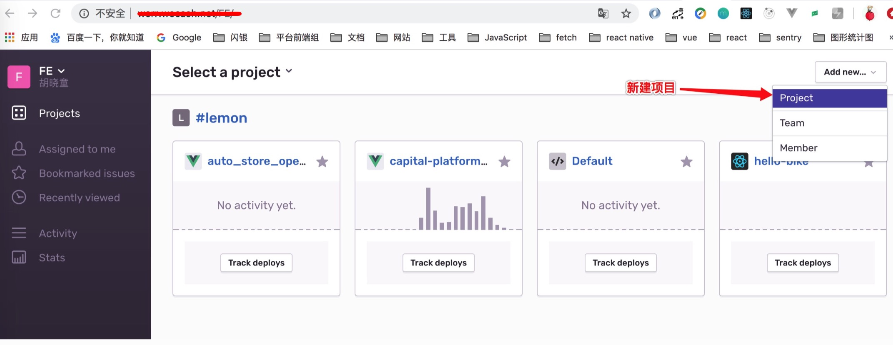
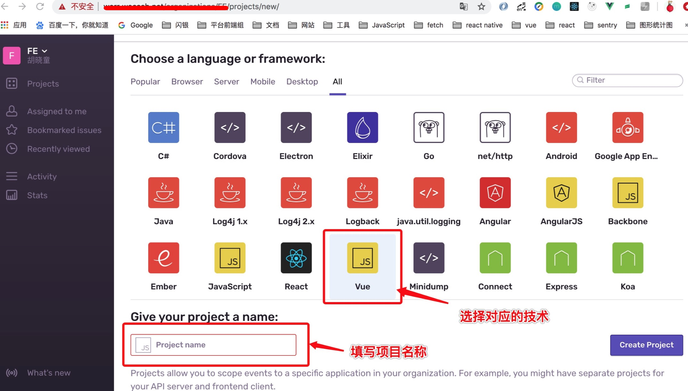
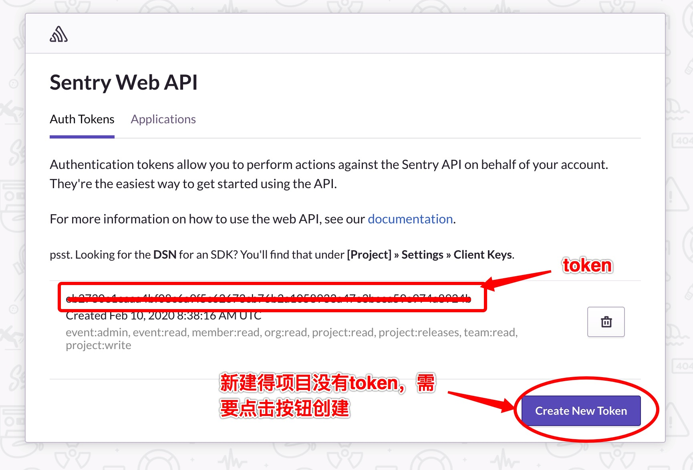
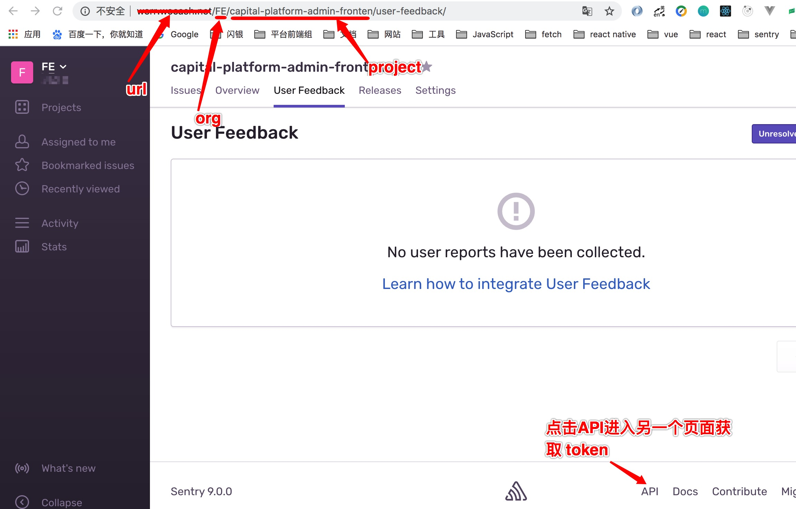
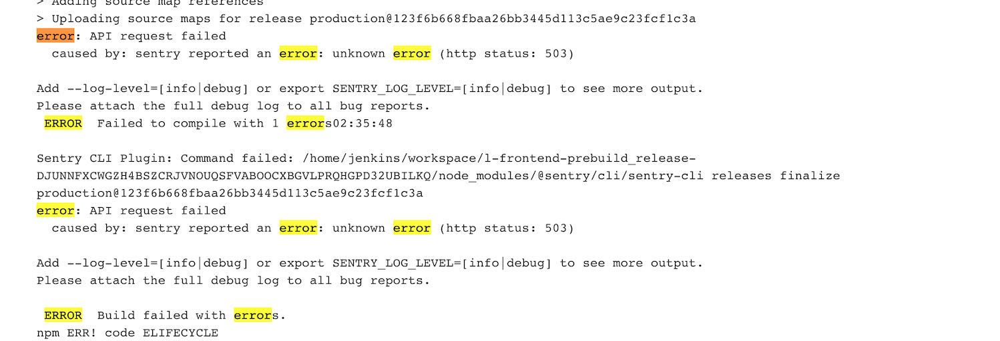
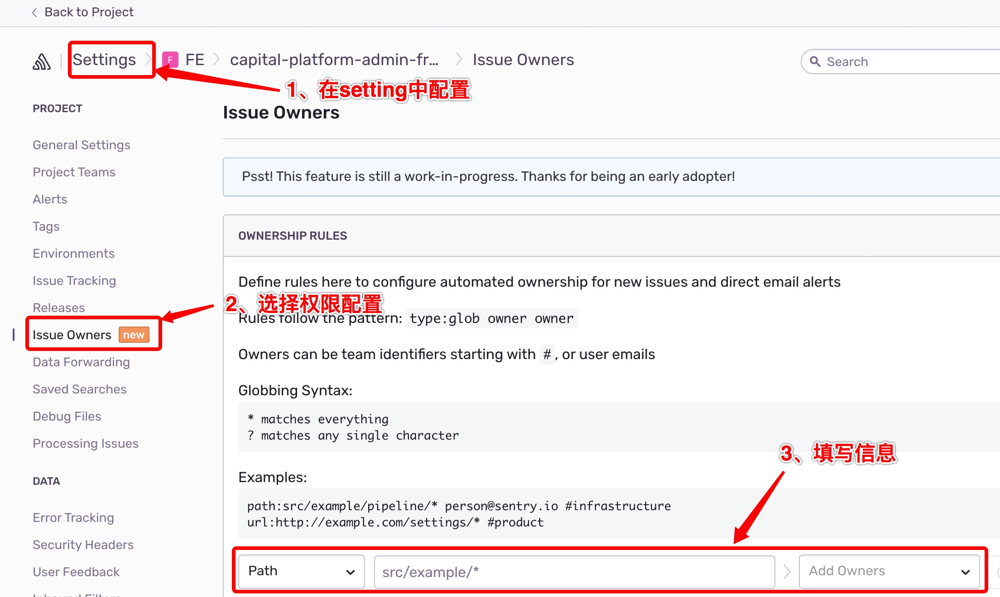

# sentry
[文档](https://hxiaotong.github.io/document/)

### VUE项目接入sentry
#### 一、公司sentry网址：http://werr.XXX.net/FE/

#### 二、sentry网址主要操作
##### 新建项目



#### 三、项目引入sentry
##### 安装依赖
```javscript
yarn add @sentry/browser @sentry/integrations
```

##### 1、main.js配置
###### 获取dsn

###### 全局配置release
```javascript 
// vue.config.js文件中
const gitSha = require('child_process').execSync('git rev-parse HEAD').toString().trim()
const SentryWebpackPlugin = require('@sentry/webpack-plugin')

process.env.RELEASE_VERSION = gitSha.substr(0, 7)
```
``` javascript
// main.js文件中
import * as Sentry from '@sentry/browser'
import * as Integrations from '@sentry/integrations'

if (process.env.NODE_ENV === 'production') {
  Sentry.init({
    release: process.env.RELEASE_VERSION,
    dsn: 'https://XXXX@werr.wecash.net/9',
    integrations: [
      new Integrations.Vue({
        Vue,
        attachProps: true
      })
    ]
  })
}
```
### 接入Source Maps 
##### 安装依赖
```javscript
yarn add @sentry/webpack-plugin --dev
```
##### 1、vue.config.js配置
```javascript
// vue.config.sj文件中
configureWebpack: config => {
  if (process.env.NODE_ENV === 'production') {
    config.plugins.push(
      new SentryWebpackPlugin({
        release: process.env.RELEASE_VERSION,
        include: './dist/js/',
        urlPrefix: '~/js/',
        ignore: ['node_modules', 'vue.config.js'],
        configFile: '.sentryclirc',
        deleteAfterCompile: true
      })
    )
  }
}
```
##### 2、建立.sentryclirc文件
```javascript
[defaults]
url=https://werr.XXX.net/
project=capital-platform-admin-fronten
org=FE

[auth]
token=XXXX

[log]
level=debug
```

##### 在sentry网站中获取的配置参数



### 项目正常接入sentry后，踩到的坑

##### 一、项目在jerkins上部署失败

是服务器内存不足，找运维解决了。

##### 一、项目报错全组人都能收到邮件
###### 解决办法
