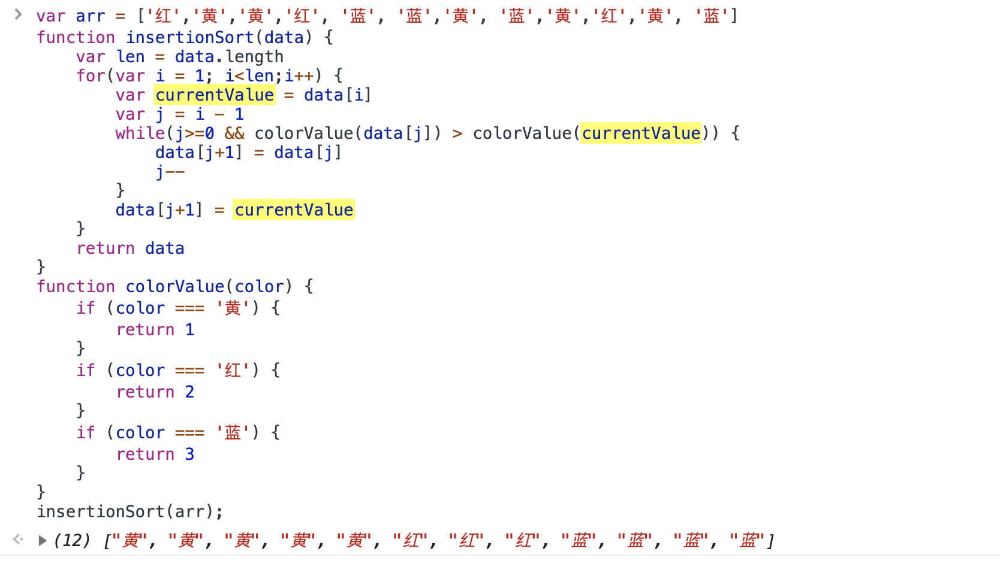

# Js 中的排序算法和数据结构


## 冒泡排序
算法描述：按位比较，前一位跟后一位比较，把数字大的排到数字小的后面，第一趟冒泡之后确定最大值，需要遍历的长度逐级递减。
（1，2）（2，3）（3，4）……（n-1,n）
```js
var data = [1,2,3]
function bubbleSort() {
    var temp = []
    for (var i = data.length; i > 0; i--) {
        for (var j = 0; j < i-1; j++) {
            if (data[j+1] < data[j]) {
                temp = data[j]
                data[j] = data[j+1]
                data[j+1] = temp
            }
        }
    }
    return data;
}
```

## 插入排序
算法描述：可以看做是玩牌，拿到一把顺序打乱的扑克牌，左侧开始第一张默认是排好顺序的牌，拿起未排序的第一张牌，跟排好序的牌从右向左依次比较，找到小于自己的那张牌，把拿起的这张牌插到比自己小的牌的后面。
```js
var data = [1,2,3]
function insertionSort() {
    var len = data.length 
    for(var i = 1; i < len; i++) {
        var currentValue = data[i] // 当前需要拿来比较的未排序的值
        var j = i - 1 // 需要比较的已排序的位置
        while(j >= 0 && data[j] > currentValue) {
            data[j+1] = data[j]
            j--
        }
        data[j+1] = currentValue
    }
    return data
}
```
:::tip
实例应用
:::

## 希尔排序[缩小增量排序]
算法描述：希尔排序是对插入排序的优化，克服了插入排序的一次只能交换相邻两个数的缺点。


2、选择排序
3、插入排序


1、希尔排序
2、归并排序
3、快速排序