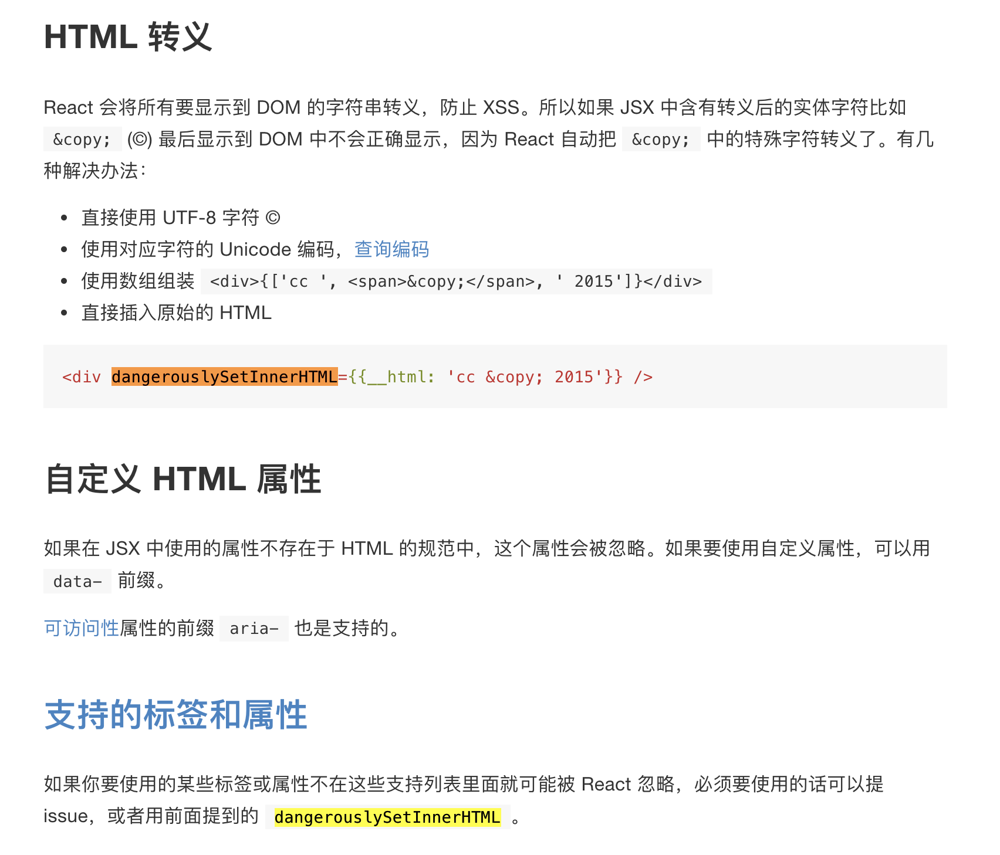

## JSX

### 知识点
1、HTML 里的 class 在 JSX 里要写成 className，因为 class 在 JS 里是保留关键字；同理某些属性比如 for 要写成 htmlFor；style 属性接受由 CSS 属性构成的 JS 对象。
```js
var myDivElement = <div className="foo" />
```

2、属性值表达式使用{}
```js
var person = <Person name={window.isLoggedIn ? window.name : ''} />
```
子组件也可以作为表达式使用
```js
var content = <Container>{window.isLoggedIn ? <Nav /> : <Login />}</Container>;
```

3、注释：在一个组件的子元素位置使用注释要用 {} 包起来。
```js
var content = (
  <Nav>
      {/* child comment, put {} around */}
      <Person
        /* multi
           line
           comment */
        name={window.isLoggedIn ? window.name : ''} // end of line comment
      />
  </Nav>
);
```

4、自定义 HTML 属性前缀：data- 或者 aria-
