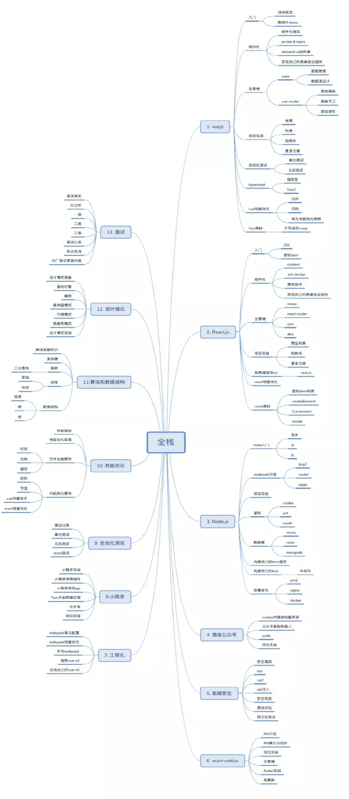

## VUE

### 入门
1. 语法概览
2. 购物车demo

### 组件化
1. 组件化通信
2. prvide & inject
3. element-ui 组件库
4. 实现自己的表单验证组件

### 全家桶
1. vuex：
    1. 数据管理
    2. 数据流设计
2. vue-router
    1. 路由跳转
    2. 路由守卫
    3. 路由鉴权

### 自动化测试
1. 单元测试
2. E2E测试

### typescript
1. 强类型
2. vue3

### vue性能优化
1. SSR
2. 网购
3. 常见性能优化策略

### VUE源码
1. 手写迷你vue.js
